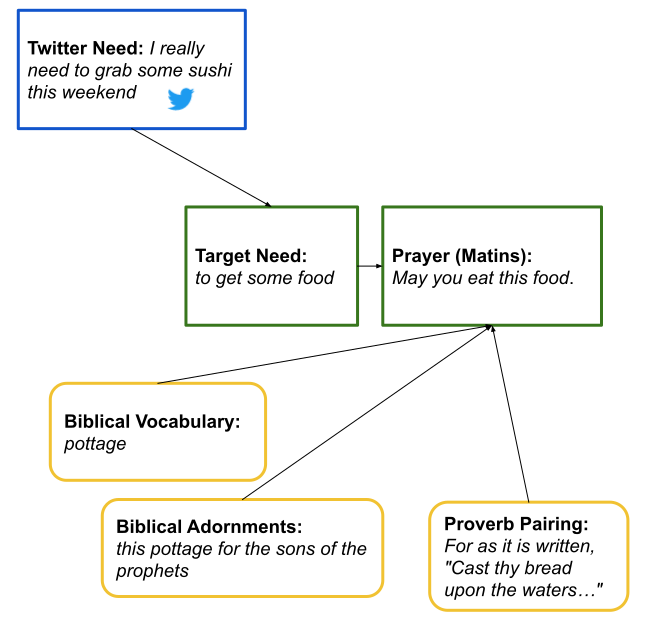

# To Pray Without Ceasing

To Pray Without Ceasing is an algorithmic web-app that invites users to pay attention to the needs of strangers. It listens for expressions of need on Twitter (e.g. "I really need somebody to talk to"), especially those tweeted by Twitter users who have few followers. It then generates empathetic prayers specific to these needs. I completed the first version of To Pray Without Ceasing during a residence via [Nokturno.fi](http://residence6.nokturno.fi/) in late 2020/early 2021.

To make the system pray, the visitor must keep lit a virtual candle that slowly burns down and is eventually extinguished. However, this is not a particularly demanding ritual; the web-app is designed to be left on in the background of one's day, checked in upon and tended to from time to time.  

Evoking the "Liturgy of the Hours," the system prays in different ways at specific times of the day. Consuming the entire progression of the prayers (Matins, Lauds, Prime, Terce, Sext, Nones, Vespers, and Compline) takes at minimum 24 hours, longer should the visitor let the candles go out, halting progress.  However, each day the system generates new prayers for new tweets. And so the loop begins again, from yesterday's weary Compline to today's fresh Matins.

When visiting the web-app, the visitor must move their cursor slowly, with respect for the holiness of the space.  Moving the cursor too quickly may result in a stern warning---but no number of violations results in the visitor's expulsion. 

## Computer-Augmented Prayers

To Pray Without Ceasing issues prayers via a combination of information-retrieval and what I'd call computer-augmented (rather than computer-generated) writing.  Using [sentence vectors](https://www.sbert.net/), the system tries to match need-statements from Twitter to one of a finite list of Target Needs that I have written.  Through composing these Target Needs, I have decided in advance what kinds of tweets for which the system will pray as well as those for which it will not. 

Each of these needs is paired with a prayer that I have written, but these prayers are bland and half-baked.  I want them to be ornate and even opaque in the ways that liturgical writing can be. Here is where the computer-augmentation comes in.  Each prayer that I have written may be augmented in three ways:

1. *filled in* with certain words that occur frequently in the King James Bible
2. *adorned* with semantically-relevant grammatical chunks extracted from the King James Bible using SpaCy's dependency parser; for instance, a reference to the noun "song" may be adorned with a preposition phrase used to describe this noun, such as "of the drunkards"
3. *matched* with sentences extracted from the Proverbs as well as Ecclesiastes, again using sentence vectors

<!-- 
## Prayer Interface

A *tweet* (embedded using Twitter's [oEmbed API](https://developer.twitter.com/en/docs/twitter-api/v1/tweets/post-and-engage/api-reference/get-statuses-oembed)) appears on an altar, flanked by three candles. The visitor activates To Pray Without Ceasing by lighting these candles. So long as one is lit, the prayers will appear above a succession of needful tweets.

A clock appears, noting the time until the next liturgical hour.

A -->

